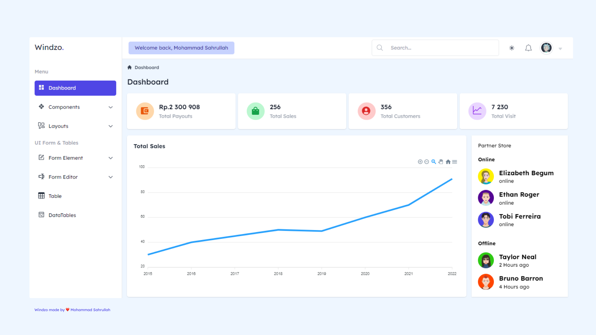

<h1 align="center">Windzo Dashboard Admin</h1>
<p align="center">this dashboard app on development fork 
this repo and contribute</p>

<div align="center">


<a href="https://www.npmjs.com/package/windzo">

</a>
</div>

<p align="center">Windzo is a free open source dashboard admin template, using vue js and tailwind css framework, make your app build easily and fast.</p>

### Light mode

<!--  -->


### Dark mode


<!--  -->

## Live Demo

Click here to <a href="https://windzo.vercel.app/">Live Demo.</a>

## Installation

<p>1. clone this repo first or download zip code </p>

```
git clone https://github.com/sahrullahh/windzo.git
```

<p>2. Open windzo folder and follow the step </p>

## Step to run this app

## 1. Project setup

<p>before use,  install all dependencies app first with command :</p>

using npm :

```
npm install
```

using yarn :

```
yarn install
```

### 2. Compiles and hot-reloads for development

<p>run this command to compile code :</p>

using npm :

```
npm run serve
```

using yarn :

```
yarn serve
```

### 3. Compiles and minifies for production

<p>build your app project to production with command :</p>

using npm :

```
npm run build
```

using yarn :

```
yarn build
```

## Open Contribute

This repository ready to contribute

##### Contribute Guide

- Fork this repository
- `npm install` or `yarn install`
- make change
- open pull request

## Author

Windzo is created by <a href="https://github.com/sahrullahh">Mohammad Sahrullah.</a>

## License

[MIT](https://github.com/sahrullahh/windzo/blob/master/LICENSE)
